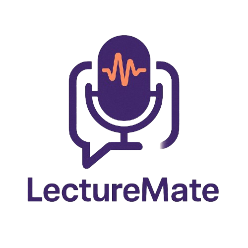

# 🎙️ LectureMate

LectureMate is a popup window for an intelligent voice-based lecture evaluator that enables real-time lecture analysis, question generation, and performance feedback using AI and speech recognition.



---

## 📌 Features

* 🗣️ **Voice Recording**: Capture lecture audio directly from your browser via a popup interface.
* 📜 **Transcription**: Convert spoken words into text using Google's Speech Recognition API.
* 🧠 **AI Question Generator**: Auto-generate concise, relevant questions based on lecture content using OpenAI's GPT 4.1.
* ✅ **Answer Evaluation**: Submit answers and receive instant feedback and a grade.
* 💾 **Session Storage**: Save transcripts, questions, and feedback to MongoDB for review and analysis.

---

## 🚀 Getting Started

### Prerequisites

* Python 3.8+
* Node.js & npm (for frontend assets, optional)
* MongoDB Atlas or local MongoDB instance
* OpenAI API token

### Installation

1. **Clone the repository**:

   ```bash
   git clone https://github.com/yourusername/lecturemate.git
   cd lecturemate
   ```

2. **Create and activate a virtual environment**:

   ```bash
   python3 -m venv venv
   source venv/bin/activate      # on Linux/Mac
   venv\\Scripts\\activate     # on Windows
   ```

3. **Install Python dependencies**:

   ```bash
   pip install -r requirements.txt
   ```

4. **Set environment variables** in a `.env` file:

   ```dotenv
   MONGODB_URI=<your-mongodb-uri>
   HUGGINGFACE_TOKEN=<your-hf-token>
   USER_ID=your_user_id
   SESSION_ID=unique_session_id
   MODEL_NAME=valhalla/t5-small-qg-hl
   ```

5. **Run the Flask app**:

   ```bash
   python run.py
   ```

6. **Open in browser**:

   Navigate to `http://127.0.0.1:5000/home` and click **Start LectureMate** to start recording.

   **User Data**
   * You can also add ?username=<your-username> to save it for a specific user
   * While on a specific user you can see your sessions feedbacks and grades.

---

## 🗂️ Project Structure

```
LectureMate/
├── app/                 # Core application package
│   ├── __init__.py      # App factory
│   ├── routes.py        # Flask route definitions
│   ├── voice_analyzer.py# VoiceRecorder class and logic
│   └── user_data.py         # User data
│
├── static/              # Static assets
│   ├── images/          # Logo and promo images
│   │   ├── logo.png
|   │   ├── example_home_page.png
│   │   └── favicon.PNG
│   ├── popup.js         # Frontend popup logic
|   ├── user-grades.css # Styles for feedbacks page
│   └── styles.css       # Styles for main page
│
├── templates/           # HTML templates
│   ├── layout.html      # Base template
│   ├── user-grades.html # Feedbacks page
│   └── home.html       # Popup launcher page
│
├── tests/               # Unit tests
│   ├── test_import.py # Test core logic
│   ├── test_model.py # Test prompt using Hugging-Face models for questions and feedbacks (Prompt Engineering)
│   ├── test_quete_gen.py # Test prompt using OpenAI API for questions and feedbacks (Prompt Engineering)
│   └── test_whisper.py # Test a second option for analyzing audio - using whisper API (require GPU and model storage)
│
├── .env                 # Environment variables
├── .gitignore
├── requirements.txt     # Python dependencies
├── run.py               # App entry point
└── README.md            # Project documentation
```

---

## ⚙️ Usage

1. Click **Start Session** to begin capturing audio.
2. Use **Pause/Resume** to manage recording segments.
3. **Answer Question** processes and submits your answer for AI feedback.
4. **Stop Recording** ends the session and saves data to MongoDB.
5. **User Grades** opens the user's sessions feedbacks.

---

## 📝 Contributing

Contributions are welcome! Please open an issue or submit a pull request.

---

## 📜 License

This project is licensed under the MIT License. See [LICENSE](LICENSE) for details.
